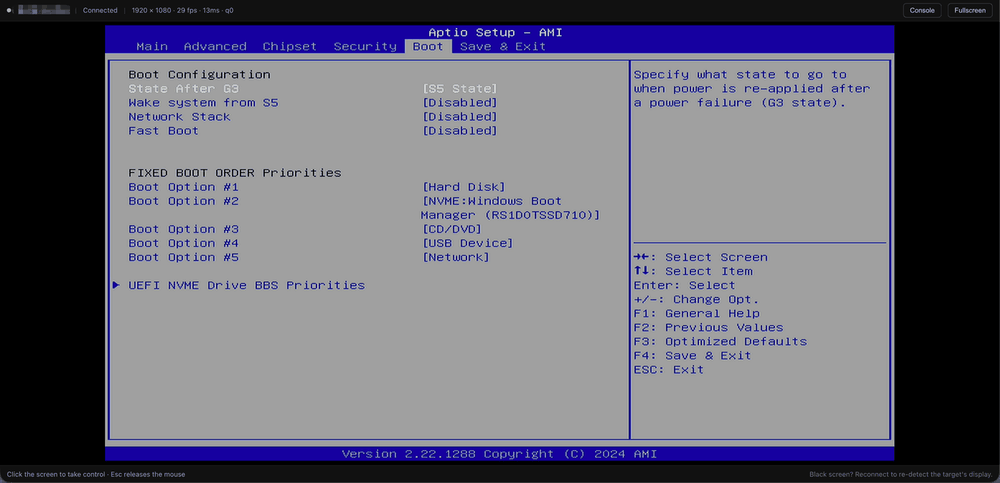

# Beacon KVM on a Raspberry Pi

[Beacon](https://www.beacon-kvm.com) is an IP KVM: the screen, keyboard and
mouse of any computer, in a browser, at BIOS level. Nothing is installed on the
machine you control.



This is the trial build for a **Raspberry Pi 4B**.

If you want something simpler and easier to use, buy our KVM hardware:
[beacon-kvm.com/#pricing](https://www.beacon-kvm.com/#pricing).

## What you need

| | |
|---|---|
| **Raspberry Pi 4B** | Not a Pi 5 |
| **A USB HDMI capture card** | 1080p, UVC |
| **A USB-C data cable** | Pi to the machine you control |
| **A network cable** | Or 5 GHz Wi-Fi |
| **A 5.1 V 3 A supply with bare wires or a barrel-to-header lead** | For the GPIO header |
| **64-bit Raspberry Pi OS** | Bookworm |

## Install

### 1. Power the Pi from the GPIO header

5 V to pin 4, ground to pin 6. Leave the USB-C port free — Beacon needs it for
the keyboard.

> ⚠️ Measure the supply before connecting it: red to pin 4, black to pin 6.
> Reversed, it destroys the board.

### 2. Connect the cables

| Cable | On the Pi | At the other end |
|---|---|---|
| **HDMI** | The capture card | The machine's video output |
| **USB-C** | The USB-C port | Any USB socket on that same machine |
| **Ethernet** | The Ethernet socket | Your router or switch |

Two things to get right:

- The capture card goes in a **blue** socket. A black one is USB 2, where the
  picture is capped near 10fps.
- HDMI goes into the **capture card**, not into the Pi's own HDMI socket.

### 3. Run the installer

```bash
curl -LO https://github.com/BeaconBeacon/KVM/releases/latest/download/beacon-pi.tar.gz
tar xzf beacon-pi.tar.gz
cd beacon-pi
sudo ./install.sh
```

**Write down the serial and the link it prints.** You need them in step 5.

### 4. Reboot

```bash
sudo reboot
```

### 5. Add it to your account

Open the link the installer printed:

```
https://beacon-kvm.com/b/BCN-PI-XXXXXXXXXXXX
```

Sign in, click **Add to my account**, then open it from
[console.beacon-kvm.com](https://console.beacon-kvm.com).

## If it does not work

```bash
sudo hid-selftest.sh                                    # keyboard and mouse
sudo journalctl -u beacon-kvm-pi -n 100 --no-pager      # everything else
```

[Open an issue](https://github.com/BeaconBeacon/KVM/issues/new/choose) with
that output.
