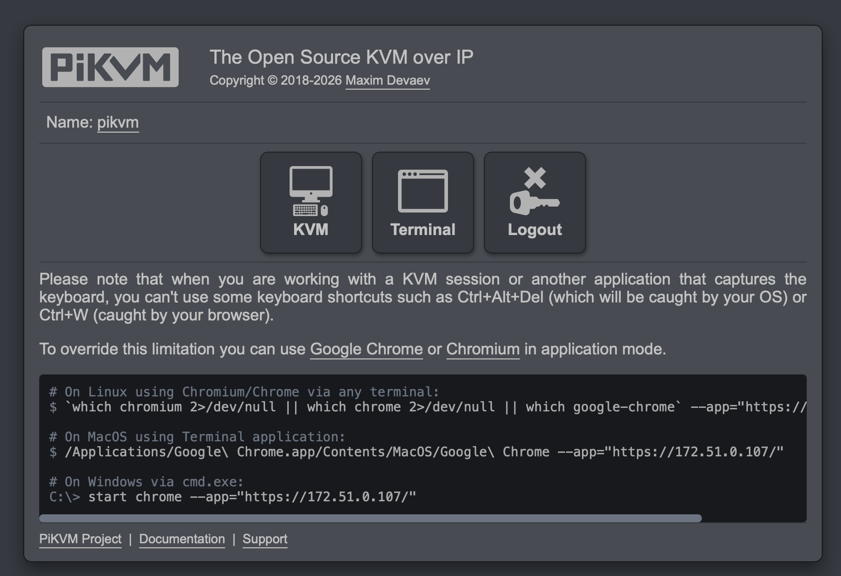
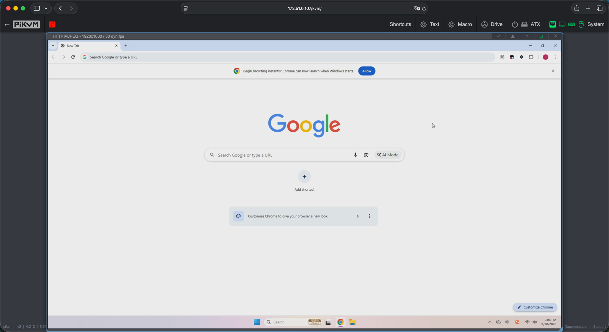
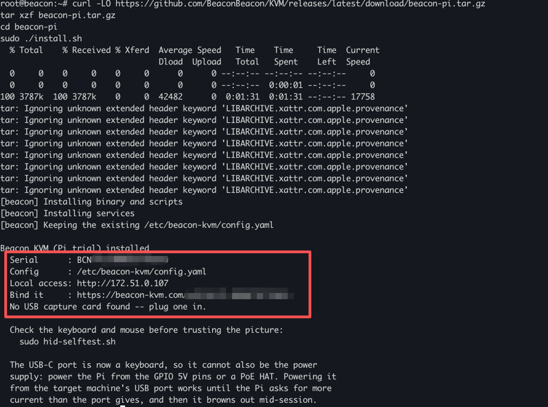
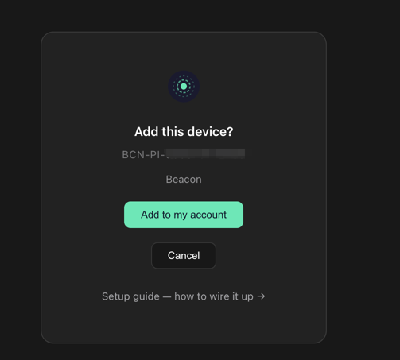
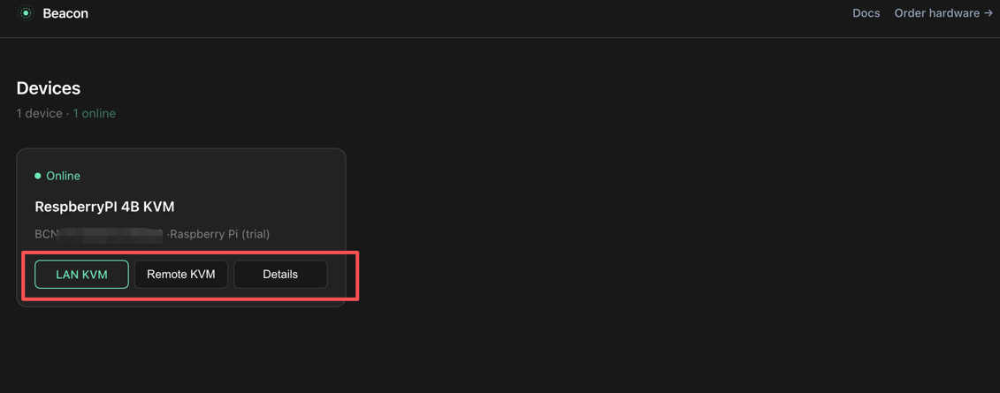
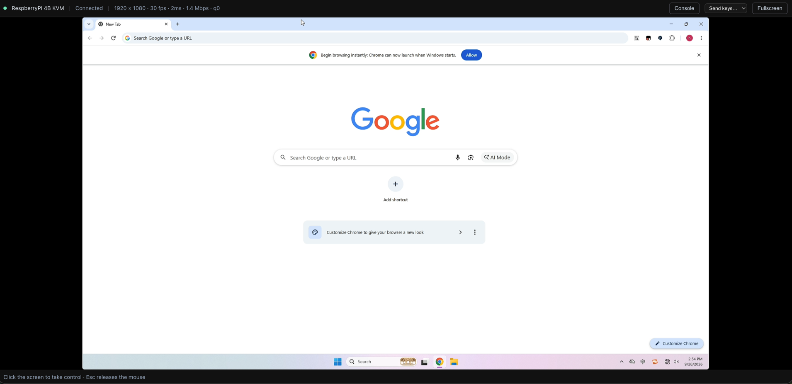

# BeaconKVM or PiKVM: build your own IP KVM with a Raspberry Pi

We recently built an IP KVM of our own — [BeaconKVM](https://beacon-kvm.com). The best-known product in
this space is PiKVM, so in this article we're going to compare ourselves with
PiKVM and see where we do well, where we're only average, and where we could
improve.

Both BeaconKVM and PiKVM have a Raspberry Pi version, which means you can get
either of them running without buying any hardware. That's a fairly obvious
difference from most other KVMs.

This article is organised like this:

- What an IP KVM is, why I'd use one, and whether remote desktop isn't enough
- Building an IP KVM with a Raspberry Pi + PiKVM
- Building an IP KVM with a Raspberry Pi + BeaconKVM
- Comparing the pros and cons, and which one I should choose

## What is an IP KVM

KVM stands for Keyboard, Video, Mouse. From those three words you can roughly
tell what an IP KVM is: a piece of emulation that emulates the keyboard, mouse
and monitor of the target machine, and through that gives you control and a
picture.

Put simply, you visit the KVM device's IP in a browser and you get:

1. The controlled machine's screen, shown in the browser
2. Keyboard and mouse control of that machine, by using them in the browser

More advanced ones also have things like power control.

At first glance it looks the same as remote desktop, but once you look at the
emulated keyboard, mouse and monitor you can see the difference — these are
peripherals, and peripherals don't depend on the operating system. For example,
your monitor doesn't stop showing a picture just because your system crashed,
right? Take the classic Windows blue screen: on an IP KVM you can see the blue
screen, whereas with remote desktop software, once the system has blue-screened
you can't connect at all. Remote desktop software is a parasite on the
operating system — if the OS has a problem, it's unusable. And an IP KVM is for
exactly the case where the OS has a problem, the emergency case.

Looked at that way, I don't think IP KVMs and remote desktop compete with each
other. They both look like remote control, but the pain they solve is
different. Most of the time we use remote desktop to solve a convenience
problem; we use an IP KVM to solve an emergency, so you don't have to get in a
taxi or buy a plane ticket and go to the site.

IP KVMs are expensive partly because they need specific hardware, and partly
because they're worth so much to the user — the cost of a single trip is
already enough to buy one IP KVM, and everything after that is profit.

## PiKVM

[PiKVM](https://pikvm.org/) is one of the better-known KVMs. Its defining
feature is that it's built on a Raspberry Pi: as long as you have one, you
don't have to buy their hardware, you can build it yourself.

That said, if you're a user without a technical background, building it on a Pi
isn't all that friendly — you might not even have heard of a Raspberry Pi, and
on top of that you have to sort out GPIO power, HDMI input and so on. The
barrier is fairly high, which is why they also sell their own hardware.

PiKVM is fairly simple to use (if it were complicated I wouldn't have wanted to
bother either). Let's look at roughly what installing it involves:

1. What you need

A Raspberry Pi 4B + a GPIO power lead + a capture card + a USB-C cable and
various other cables. For video capture I just bought a USB capture card
separately, rather than the HDMI capture board the official docs suggest.

2. Flash the system PiKVM officially provides

Once installed, find the Pi's local IP, open it in a browser, click KVM, and
the KVM opens. Very little difficulty.

Let's look at what it ends up like:





There really are a lot of features.

Now let me go through the pros and cons.

First the pros:

- It's installed by flashing an image, so you don't have to fight with the
  software yourself — although this is also a downside, which we'll come to
- The experience is good. From the screenshots above you can see it's sharp,
  and personally I found it smooth enough to use, but there are two cursors:
  one for the controlled machine and one for PiKVM
- Lots of features. From the top-right menu you can see hotkeys, text paste,
  ATX and other optional features — this is probably why a lot of people choose
  PiKVM

Then the cons:

- If it's flashed as an image, you need a separate device for it. You can't
  reuse a Raspberry Pi that's already in use
- Local network access only. If you need remote access, you have to set up
  Tailscale or another VPN, and the barrier jumps immediately — most people
  won't manage it. Everyone's needs are different, but for me, if there's only
  local access then it's no different from remote desktop
- It uses MJPEG, which you can think of as sending one image after another. The
  experience is good, but it takes a lot of bandwidth. That's fine on a local
  network; over the internet it gets expensive. Apparently if you buy their
  hardware it combines H.264 and MJPEG, but I haven't tried that

Overall its all-round capability is good, but it isn't very friendly to
beginners — and above all, if you have a strong need for remote KVM, PiKVM
leaves you to work out remote KVM yourself.

## BeaconKVM

BeaconKVM is fairly new. We're a networking company that builds SD-WAN, so the
networking side gets more of our attention, and the device is adapted from our
own SD-WAN router. It has three main characteristics:

- Remote access is built in, so you can do remote KVM. We come from SD-WAN and
  have global network resources, so remote KVM is a natural fit for us
- It has its own web console where you can manage several devices at once: pick
  the device in the console and start a remote KVM session
- It's simple. Very simple, especially once you've bought the hardware — plug
  in power and network, scan the QR code, and it's bound to your account

BeaconKVM also has a Raspberry Pi version as well as a hardware version. The Pi
version is mainly there to let users try the features and convert to the paid
version, but between the Pi version and the official hardware there is **no
difference at all in software functionality** — everything you get by buying
the hardware is supported on the Pi version.

Let's look at how to get the Raspberry Pi version running.

1. What you need

Exactly the same as PiKVM. No difference at all.

2. Install the software

We give you a one-line install command rather than an image to flash, which
means that if you already have a Raspberry Pi, you don't have to reflash the
system — it can live alongside your existing one. That's where it differs from
PiKVM.

```bash
curl -LO https://github.com/BeaconBeacon/KVM/releases/latest/download/beacon-pi.tar.gz
tar xzf beacon-pi.tar.gz
cd beacon-pi
sudo ./install.sh
```



After running the command you get a binding link. Open it and the device is
bound to your account.



Then reboot. We've written detailed instructions for all of this, so I won't
repeat them here: https://github.com/BeaconBeacon/KVM

Let's look at what using it is like.



In the web console you can see the LAN KVM and Remote KVM entry points, so you
don't have to go looking for its local IP. The one we mainly want to try here
is Remote KVM.



Sharpness and responsiveness are both fine, but there are relatively fewer
features than PiKVM — things like ATX, clipboard and CD-ROM aren't there, only
the core functionality.

Overall, if you don't want to fiddle too much and you have a strong need for
remote access, BeaconKVM may be the better choice. The barrier is fairly low,
but the product is fairly new and a lot of features aren't there yet; those can
only be added over time.

## Pros and cons

We've gone through how each one is used above; here they are side by side.

| | PiKVM | BeaconKVM |
|---|---|---|
| Installation | Flash their official image; the Pi has to be dedicated to it | One command; lives alongside your existing system |
| Remote access | Set up Tailscale or another VPN yourself | Built in, nothing to configure |
| Managing several devices | None. One local IP per device, remembered by you | A web console with all your devices in one list |
| Features | Plenty — ATX, clipboard, CD-ROM, hotkeys | Core functionality only |
| Maturity | Established, big community, you can search for answers | Fairly new, not much written about it |

The hardware requirements are identical on both sides and both do LAN KVM, so
we haven't listed those separately.

**If your Raspberry Pi is spare, the machines you want to control are on your
local network, or you already run something like Tailscale, pick PiKVM** — it
does more, the community is mature, and when you hit a problem you can find how
someone else solved it.

**If your Raspberry Pi is already running something else, or the machine you
want to control is somewhere else and remote access is a hard requirement, pick
BeaconKVM** — the time it saves you is real, and the price is that it does
less, with a lot still missing.

Installing both is fine too. The hardware requirements are identical, so it's
just a matter of swapping the SD card.

---

[All articles](README.md) · [Build your own on a Raspberry Pi](../README.md)
